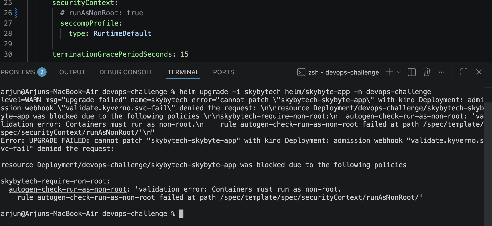

# **### Decision: secret implemented via K8s**

**Context:** It help to expose Crendential/Token in Plan git repo.

**Options considered:** K8s secret, Via Terraform, External services(Azure key valut, Hashicorp Vault... etc)

**Chosen:** K8s secret

**Rationale:** As this assisgment level its good. but for production level always setup External services for better security. 

**Cost / risk you accepted:** Risk K8s Secret Basic level Encrption with Base64

# **### Decision: Image build direct into minikube**

**Context:** Save more effort

**Options considered:** minikube image, Docker image, External tools(buildah, kaniko)

**Chosen:** Minikube image 

**Rationale:** Not need to load image into minikube

**Cost / risk you accepted:** its suitable for local env setup. 

### Decision: <ServiceMonitor Over the Prometheus scrape annotations>

**Context:** The application must expose Prometheus metrics (http_requests_total and http_request_duration_seconds) and provide a mechanism for Prometheus to discover and scrape the /metrics endpoint in a Kubernetes environment.

**Options considered:** Prometheus scrape annotations and ServiceMonitor

**Chosen:** ServiceMonitor

**Rationale:** why — referencing the constraint, not generic best-practice

**Cost / risk you accepted:** what you knowingly didn't optimise for

### Decision: <Policy as Code - Kyverno or Gatekeeper>

**Context:** preventive controls that automatically detect and block configuration mistakes before they reach the cluster.

**Options considered:** Kyverno or Gatekeeper

**Chosen:** Kyverno

**Rationale:** Kyverno policies are defined using Kubernetes-style YAML, making them easier to review, maintain, and integrate into existing Helm and GitOps workflows.

**Cost / risk you accepted:** Kyverno provides less flexibility than custom OPA/Rego policies for highly complex policy logic.

### Decision: <Choose terraform way to deploy Kyverno policy resources>

**Context:** The project requires Kubernetes admission policies to prevent security and reliability regressions from being deployed

**Options considered:** Terraform or helm chart

**Chosen:** terraform

**Rationale:** Managing Kyverno installation and policy resources within the same Terraform codebase provides a single source of truth for cluster configuration

**Cost / risk you accepted:** Terraform state now includes policy resources, increasing the scope of infrastructure management

### Decision: <install Kyverno helm chart via Bash>

**Context:** A policy engine must be installed in the cluster before applying the required validation policies

**Options considered:** Bash Script, Terraform, Manually

**Chosen:** Bash scripting

**Rationale:** While doing via terraform its not allowed sametime both Kyverno helm chart and policy resource. 

**Cost / risk you accepted:** NA

### Decision: <Create destroy.sh -/ opposite of setup.sh >

**Context:** The setup process installs cluster dependencies and provisions Kubernetes resources. Reviewers need a repeatable way to remove all resources created during setup and return the cluster to its original state.

**Options considered:** Manual cleanup , automation(Bash)

**Chosen:** Automated cleanup using destroy.sh

**Rationale:** The environment is created through a combination of Helm and Terraform. Providing a matching cleanup script ensures resources are removed in the correct order and enables repeatable testing without manual intervention.

**Cost / risk you accepted:** reduce time cost.

### Decision: <choose flask8 over Ruff>

**Context:** The project requires automated Python linting in CI to catch code quality issues before deployment.

**Options considered:** Ruff and Flask8

**Chosen:** the option you picked

**Rationale:** The application is a small Flask service with a simple codebase. Flake8 provides the required linting capabilities with minimal configuration and is a well-established standard in many Python projects.

**Cost / risk you accepted:** Flake8 executes more slowly than Ruff

**Proof of Policy as code Implementation**

